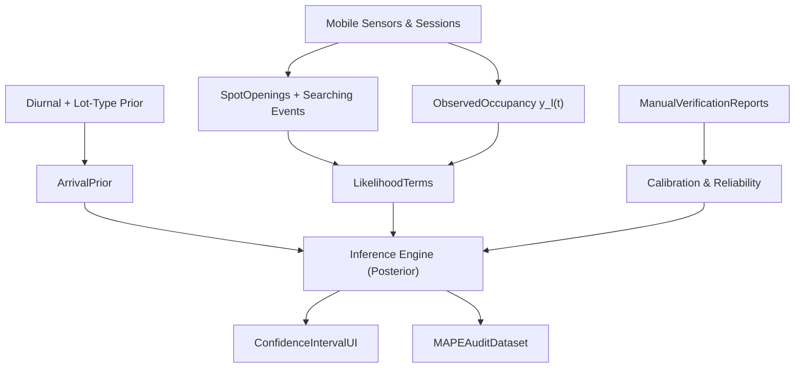

# ScarletSpots Inference & Ground Truth Plan

## 0) Threat model (sampling bias) + objective

We only observe the subset of cars/parkers that use the app, yet we need 80–90% occupancy accuracy across 200+ lots. Treat the true per-lot occupancy as a latent state and the app signals as biased, noisy observations.

We will build a probabilistic, physics-constrained estimator that:

- uses phone-sensor “spot openings” and “searching” as additional observation channels

- calibrates the observation bias using incentivized manual verification + periodic manual audits

- outputs occupancy as a distribution (low/high) rather than a single number

## 0.5) Cold start: no users, no parking telemetry (why everything shows 0%)

### Why the product shows 0% today

Live occupancy in the app is driven by **`lot_occupancy.count`** (and the client applies that to bundled lot capacity). If there is **no row** for a lot, or the count is **0** and you have **no sessions**, the UI correctly reflects **“we have observed zero app-tracked cars”** — but that is **not** the same as **“the lot is empty.”** Treating missing or zero counts as “0% full” is a **display/semantics bug** for launch: users infer ground truth from a number that is really **unobserved**.

### Prior-only model (typical signals, zero app data)

Before any users exist, you can still produce a **non-degenerate estimate** by using **only structural priors** (no `y_l`, no sessions):

1. **Diurnal / day-of-week baseline (primary)**  

   A campus-wide or per-campus template derived from historical patterns: `p_l^time(t)`. This is essentially what `HeuristicForecastProvider` already produces — the key difference is it must **not** be anchored to `current_occupancy=0`. It captures “Tuesdays at 2pm are usually busier than Saturdays” with zero app data.

2. **Lot-type shrinkage (secondary)**  

   Use bundled metadata (`garage`, `student`, `employee`, campus code) to **shrink** estimates toward group means: e.g. garages vs surface lots, or lots near stadium vs academic core. This is weak signal but stabilizes cold lots.

3. **Fusion rule (simple and defensible)**  

   Blend with uncertainty weights:

   - `p_l^prior(t) = w_time * p_l^time(t) + w_type * p_l^type`  

   - Require `w_time + w_type = 1` so the blend is a proper convex combination.  

   **Widen** the confidence band when only priors are active (no app sessions yet).

4. **What you show in the UI**  

   - Label clearly: **“Estimated”** (not “Live”).  

   - Prefer a **range** from day one: e.g. `35–55%` with copy like “No ScarletSpots parkers here yet — estimate from typical patterns.”  

   - Optionally show **observed = 0** separately as **“App-tracked: 0”** once you have telemetry, without equating it to lot fullness.

### After users arrive

When `y_l(t)` and sensor events exist, the posterior **replaces** the cold-start prior; the prior above becomes the **t=0** layer of the state-space in §1, not a permanent separate product.

## 1) Core estimator (state-space, with sampling-bias correction)

Let for each lot `l` at time `t`:

- `x_l(t)` = true occupied spaces (latent)

- `y_l(t)` = app-observed occupied spaces (what `lot_occupancy.count` currently reflects)

- `a_l(t)` = effective adoption/visibility factor (0–1)

### 1.1 Dynamics (physics-based)

Use an arrivals/departures model with time-of-day-driven arrivals:

- `x_l(t+Δ) = x_l(t) + A_l(t) - D_l(t)`

- `A_l(t)` comes from the time-of-day arrival prior (expected arrivals inferred from the diurnal profile)

- `D_l(t)` comes from an exit/dwell-time model informed by “exit velocity” / drive-out detection

### 1.2 Observation model (sampling bias)

App sessions observe a subset of cars. We model:

- `y_l(t) ~ Binomial(x_l(t), a_l(t))` (or Poisson approximation for speed)

- event logs (spot openings, searches) add extra likelihood terms (next sections)

**Identifiability note:** `x_l` and `a_l` are not jointly identified from `y_l` alone — the same count `y_l = 10` is consistent with `x = 100, a = 0.1` or `x = 20, a = 0.5`. You need at least one of: (a) an informative prior on `a_l` from adoption-rate estimates, (b) cross-signals that independently constrain `x_l` (diurnal demand pressure, searching intensity), or (c) periodic audit observations that anchor `x_l` directly. The multi-signal design in §§3–5 is precisely what makes the system estimable.

**Binomial independence caveat:** The model assumes each car is app-visible independently with probability `a_l`. In practice users arrive in cohorts (same building, same class), so reports cluster — treat `a_l` as an approximate aggregate parameter rather than a per-car independent probability.

### 1.3 Posterior inference

At a minimum, implement Bayesian filtering over `(x_l(t), a_l(t))` using:

- time-of-day arrival prior (mean/variance from the diurnal profile)

- event likelihoods from phone-sensor detections (departures/openings + searching)

- periodic ground-truth constraints from manual verification/audits

This is what replaces the current purely observational `lot_occupancy` count in the user-facing UI.

### 1.4 Integration point with existing code

Today:

- Forecast endpoint `/api/v1/lots/{lot_id}/forecast` is wired to `MLForecastProvider` as the live default (`backend/app/routers/lots.py` → `_get_forecast_provider()`). `HeuristicForecastProvider` (`backend/app/services/forecasting.py`) exists as a dev/fallback alternative but is not the active default.

- Live UI occupancy is sourced from `/api/v1/lots/occupancy` (REST, 30-second server-side cache) **and** a WebSocket stream (`/ws/occupancy`) that pushes real-time `lot_occupancy` delta updates directly into the React Query cache in `mobile/src/features/home/screens/HomeScreen.tsx`.

Plan:

- keep `MLForecastProvider` as the primary fallback/prior; `HeuristicForecastProvider` (diurnal profile) as the cold-start prior

- introduce an `InferenceForecastProvider` that produces `expected/low/high` from the state-space posterior

- add an estimated-occupancy endpoint or (optionally) extend `/lots/occupancy` to return `{observed, estimated, low, high}`

- **decide explicitly** whether inference posterior updates augment the existing WebSocket payload (preferred for latency) or are poll-only via REST; mixing both streams without coordination will cause UI flicker

## 3) Exit Velocity & Passive Metrics → “Spot Opening” observation channel

### 3.1 What we already have (departure vs walk-out)

The current auto-end logic is in `mobile/src/shared/services/GeofenceManager.ts`:

- On geofence `Exit`, it auto-ends only when the user likely drove out:

  - `wasRecentlyDriving()` and persisted `wasDrivingRecentlyForAutoEnd()`.

The current parking detection is in `mobile/src/shared/services/ParkingDetectionService.ts`:

- detect a transition from driving (>5 m/s) to stopped (<1 m/s)

- use accelerometer stillness + heading change + inside-lot check

### 3.2 Define “Spot Opening” as a departure event

A “spot opening” is best approximated as:

- a drive-out detected for an app user who had an active session in lot l

- within a short deceleration-to-drive window after being inside that lot

So define:

- `drive_start`: speed crosses upward threshold (stopped → driving), e.g. from `<1 m/s` to `>5 m/s` within `W` seconds

- `drive_out_confidence`: combine speed transition + stillness drop + heading change

### 3.3 Passive enhancement: Bluetooth/CarPlay disconnection (optional, strengthen signal)

On some devices we can treat:

- Bluetooth audio device disconnect or CarPlay session end

as evidence of “leaving mode” when it co-occurs with `drive_start`.

Practical note (skeptical): iOS/Expo access to reliable CarPlay/Bluetooth state can be limited; treat as an optional signal that only increases confidence when available.

Formal fusion:

- `P(drive_out | sensors) ∝ P(speedTransition) * P(stillness) * P(heading) * P(conn_disconnected)`

- where `P(conn_disconnected)` is a learned multiplier (often near 1 or 0.8 if weak).

### 3.4 How “Spot Openings” improve occupancy estimates

Departures are the dominant negative feedback after class end. Spot opening evidence helps:

- constrain the dwell-time distribution (how quickly cars leave after peak hours)

- tighten the posterior for `x_l(t)` because it directly observes `D_l(t)` (for the app-user subset)

## 4) The “Vulture” Demand Metric (Searching behavior) → Arrival-rate correction

### 4.1 Define “Searching” mechanically

A user is “searching” in lot `l` when, simultaneously:

- the device is inside or near lot l (polygon containment or geofence region)

- speed is low but not walking: `v ∈ [v_min, v_max]`

  - start with `v_max = 5 mph ≈ 2.2 m/s` (your requirement)

  - set `v_min` around `0.3–0.5 m/s` to ignore idle while walking

- behavior persists for `≥ T_search` (e.g. 30–90 seconds)

- optional: low curvature/large heading variance indicates circling

This is similar in spirit to how the app already uses speed thresholds in `ParkingDetectionService.ts` (driving vs stopped).

**False-positive sources to guard against:** crawling drop-off/pickup traffic, service vehicles patrolling lots, GPS drift inside large garages, and pedestrians near lot boundaries. Use the minimum dwell duration `T_search` and, where available, the inside-lot polygon check (not just geofence proximity) as your first line of defense.

### 4.2 Logging “Vulture events”

Create an event record when a user transitions into/out of “searching”:

- `lot_id`, `start_time`, `end_time`, `avg_speed`, `path_features`, `gps_accuracy`

### 4.3 How demand improves occupancy estimate (sampling bias correction)

We have observed arrivals (app sessions) but not necessarily total demand. Searching is a demand proxy:

- `Searching_l(t)` increases when more drivers need parking.

Use it to adjust either:

- `λ_arr(t)` directly (expected future arrivals)

- or `a_l(t)` (adoption visibility) by comparing observed session starts vs searching intensity

One robust approach:

- estimate a latent “arrivals intent” score `I_l(t)` from searching intensity

- map `I_l(t)` to arrivals using a calibrated conversion factor `κ` learned from ground truth

Net effect: even when app adoption is low, searching signals from the subset that does have the app can still reveal the lot’s demand phase.

## 5) Incentivized Ground Truth (“Waze-style”) + conflict handling

### 5.1 User-facing loop

Add a lightweight prompt when the estimator is uncertain and a user is near/inside a lot:

- Buttons: `Confirm Full`, `Confirm Not Full`, optional `Count (approx)`

- Reward loop: badges, streaks, occasional priority alerts

This should be tied to uncertainty, not random.

### 5.2 Data fusion for conflicting reports

Model each report `r` as a noisy measurement of true state `x_l(t)`:

- If report is binary “full/not full,” define a threshold at `capacity_l * θ`.

- Each user `u` has a reliability `ρ_u` learned from past audits.

Then aggregate reports using Bayesian updating:

- `P(state | reports) ∝ Π_u P(report_u | state, ρ_u)`

**Correlated reports:** Users arriving together from the same class will report the same lot state within a short burst window. Treating each as an independent observation multiplies correlated evidence and produces overconfident posteriors. Group reports from the same geofence within a `T_burst` window (e.g., 5 min) and weight the burst as a single observation, or use a hierarchical model with a within-burst correlation term.

### 5.3 How to prevent gaming / spam

Include safeguards:

- throttle per user per lot per time window

- require a proximity constraint and/or “active session in last N minutes” to reduce fake inputs

- down-weight users with low reliability

## 6) Confidence Interval UI (avoid single-number overconfidence)

### 6.1 API output contract

Instead of returning a single occupancy percentage, return:

- `expected_full_rate` (or expected occupancy count)

- `low_full_rate`, `high_full_rate` (e.g. 10th–90th percentile or 25–75 depending on desired UI calmness)

- optional `confidence_reason` metadata (e.g., “high demand period, recent departures detected”)

### 6.2 UX strategy

On the map lot card / occupancy pill currently used in `mobile/src/features/home/screens/SearchScreen.tsx`:

- show a range like `85–92% Full`

- if CI is narrow (<5–7%), optionally show `~88% Full` and a subtle “high confidence” indicator

- color coding should use the expected value, but tooltips/badges should reflect the CI

The goal is to align expectations and reduce churn from “I checked and it was wrong.”

## 7) Measuring Accuracy (MAPE) with a Manual Audit protocol

### 7.1 Evaluation design (sampling-aware)

Use two complementary evaluation sets:

- Passive operational evaluation: use a **time-based holdout** (calibrate on data up to time T, evaluate on the T+delta forward window) and a **lot-based holdout** (hold out a random subset of lots from calibration to test generalization). Never let audit labels from the evaluation window feed back into same-period parameter tuning — that is the primary leakage risk.

- True ground-truth evaluation: in-person counts or high-confidence manual verification at scheduled times.

### 7.2 Manual audit protocol

For each selected lot/time slice:

- Choose representative times (peak hours ±30–60 minutes, plus off-peak)

- Auditors perform manual counts of parked cars (or validated occupancy proxy)

- Record actual `x_l(t)` and timestamp, ideally within a tight window

### 7.3 MAPE computation

For each audit record i:

- let `A_i` = actual occupancy rate (0–1 or 0–100%); let `P_i` = predicted expected occupancy

- MAPE:

  - `MAPE = (1/n) Σ |(A_i - P_i) / max(A_i, ε)| * 100`

  - use `ε` (e.g., 0.05 capacity) to avoid division blow-ups at near-zero occupancy

  - **MAPE is unreliable for sparse or nearly-empty lots** even with `ε` — a 5-point absolute error on a 3% actual is 167% MAPE. Pair MAPE with **MAE on occupancy rate** (`MAE = (1/n) Σ |A_i - P_i|`) and optionally **sMAPE** (`sMAPE = (2/n) Σ |A_i - P_i| / (|A_i| + |P_i| + ε)`) for a symmetric, bounded comparison. Report both, segmented by demand level bucket, so high-occupancy accuracy is not masked by sparse-lot noise.

- break down metrics by:

  - campus

  - lot size buckets

  - demand level buckets

  - time-of-day buckets

### 7.4 Feedback loop into calibration

Use audit outcomes to re-fit:

- departure/dwell model parameters

- conversion `Searching → arrivals intent`

- user reliability for manual reports

## 8) Extra ideas (that materially help accuracy)

- Build an explicit “walk-out vs drive-out” classifier and use it to separate `D_l(t)` (true departures) from `false departures`.

- Add an “adoption visibility prior” `a_l(t)` that changes with:

  - campus density

  - time-of-day

  - mobile “searching” intensity

- Maintain separate streams:

  - `observed occupancy` (from app sessions)

  - `estimated occupancy` (posterior)

  - both can be displayed, but UX should default to estimated.

- Use a “regret minimization” policy for when to ask for manual confirmation (only ask when CI is wide or when sensor signals disagree).

- **Privacy / consent:** Searching paths, Bluetooth/CarPlay hooks, and incentivized reports constitute location processing beyond a standard parking session. Add explicit disclosure in the onboarding flow and cap raw GPS trace retention (e.g., 7–30 days raw, aggregated stats kept longer). Design the data schema and retention policy now even if the UI is deferred.

- **Computational scale:** 200+ lots × 1-minute inference grids × joint filtering over `(x_l, a_l)` is non-trivial at real-time cadences. Plan for **batch/offline** posterior updates (e.g., a Kalman smoother run every 5 minutes) rather than true per-minute online filtering. Lot-level independence (lots do not share state) allows parallel inference and keeps the problem tractable.

## 9) System diagram

## 10) Deliverables checklist

- SpotOpening detection logic (speed transitions + optional connection disconnect)

- Vulture Searching definition + demand-to-arrivals mapping

- Ground-truth UX loop + Bayesian conflict fusion

- Confidence interval API + UX rules

- Manual audit plan + MAPE + MAE/sMAPE pipeline definition

- Fusion weight normalization rule (`w_time + w_type = 1`)

- WebSocket vs REST decision for estimated occupancy delivery

## Pointers to current code to extend (for implementation later)

- Forecast providers: `backend/app/services/forecasting.py`, `backend/app/services/ml_forecast_provider.py`

- Forecast endpoint: `backend/app/routers/lots.py`

- Existing detection: `mobile/src/shared/services/ParkingDetectionService.ts`, `mobile/src/shared/services/GeofenceManager.ts`, `mobile/src/shared/services/BackgroundTasks.ts`

- Occupancy write path: `backend/app/routers/park.py`

- Feedback: `backend/app/models/parking.py`

